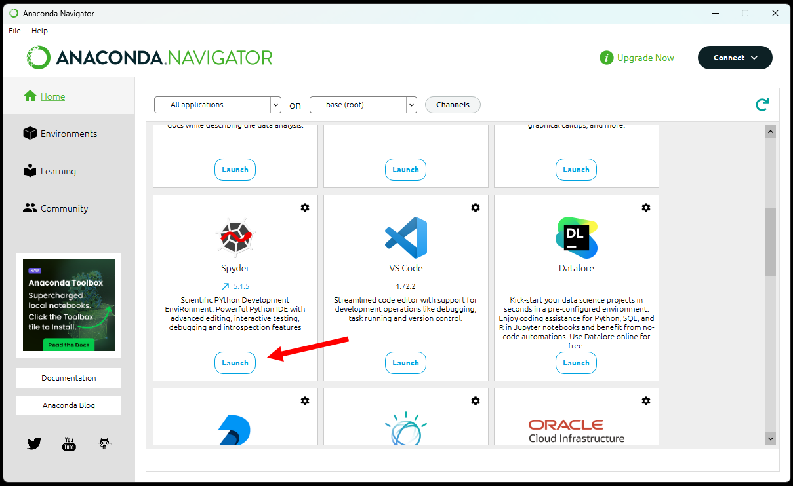
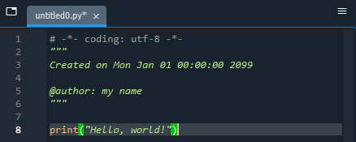
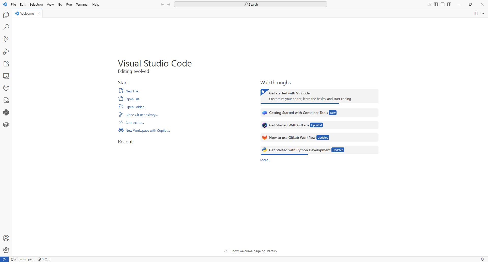
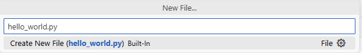
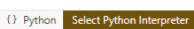
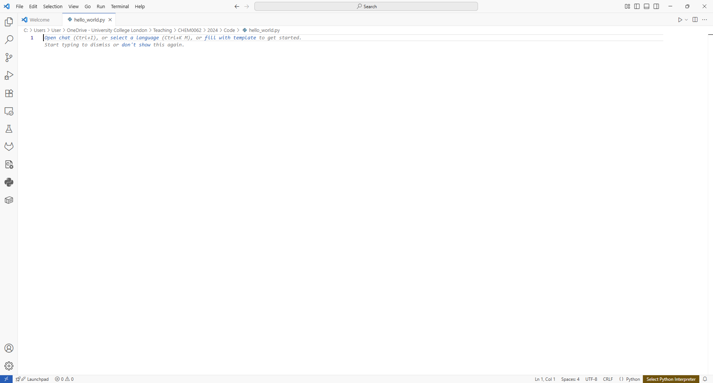
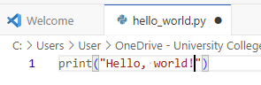

# Writing and Running a Python Program

## Prerequisites

None.

## What is a Python Program?

Python programs are sets of instructions that a computer can follow, written in a programming language called *Python*.

The Python programming language can be written on many platforms. The most common one is called a *Python program file*. This is a single plain text file ending with `.py`. You may also see them referred to as *scripts* or *source code*. Once a Python program file is written, the user can ask the computer to follow the instructions within. This is called *running* or *executing* the program.

You can write such a file in any plain text editor (e.g. Notepad or TextEdit), but it is helpful to use an editor that can write and run your code in one same place. These are called *code editors*, or if they have more features, they are called an *Integrated Development Environment* (IDE). For this lesson, we will use an IDE called *Spyder*.

# Instructions

The first step is to install Python, there are various ways to do this listed below. We advise to use conda *via* the miniforge or Anaconda installations

## Installation

<details style="padding: 10px; border-radius: 2px; border: 1.5px solid gray"> 
<summary style= "font-size:120%; font-weight: bold"> Miniforge Installation</summary>

<h2> Install Miniforge </h2>

Miniforge is a minimal install of the *conda* and *mamba* Python package managers. It currently has no license restrictions on its use.

Go to the Miniforge [repository](https://github.com/conda-forge/miniforge#install) and follow the instructions on how to install.

Once installed run the following command in a terminal to make sure Python is installed

```bash
    conda install python
```
**Note** on Windows PCs it is necessary to open either *Miniforge Prompt* to run this command

</details><br/>


<details style="padding: 10px; border-radius: 2px; border: 1.5px solid gray"> 
<summary style= "font-size:120%; font-weight: bold"> Anaconda Installation</summary>

<h4> Install Anaconda </h4>

Anaconda is a bundle of the *conda* package manager with a collection of programs and Python libraries. Together they can run and edit Python code. 

**Note** Anaconda has a license that may restrict use of the free version, depending on what you use

Go to the Anaconda [downloads](https://www.anaconda.com/download/success). If you are not sure which installer to download, choose the one from your operating system (Windows, Mac, or Linux), and select "Graphical Installer" if possible.

Once it is downloaded, **open the installer and follow the instructions**.

</details><br/>


<details style="padding: 10px; border-radius: 2px; border: 1.5px solid gray"> 
<summary style= "font-size:120%; font-weight: bold"> Basic Python Installation</summary>
<br/>
The simplest way to install Python is by itself

Go to the Python [downloads](https://www.python.org/downloads/) and download the latest version.

Once it is downloaded, **open the installer and follow the instructions**.

Python is notorious for what are called **dependency issues**. To reduce the risk of these if not using a package/environment manager such as conda you should make use of *virtual environments*. These are simple to use, for an explanation see [here](https://docs.python.org/3/library/venv.html)

To create one use the following command in a terminal
```bash
    python -m venv /path/to/new/virtual/environment
```

</details><br/>


# Writing and running your Programme

As with installing Python there are many ways to write your program, from using a text editor to using an IDE. Below we give guidance on a couple of these methods.

This is not an exhaustive list.

</details><br/>

<details style="padding: 10px; border-radius: 2px; border: 1.5px solid gray"> 
<summary style= "font-size:120%; font-weight: bold">Text Editor and Command line</summary>
<br/>
Perhaps the simplest method is to write your Python code in a text editor and then run on the command line, though this lacks the power of an IDE environment to make your life easier.

Open the text editor of your choice and **write the following in a new file:**

```print("Hello, world!")```

Make sure it is saved, for example as *hello_world.py*. 

Open the command line window and type the following:

```bash
    python hello_world.py
```

This will run your programme and print 

<tt> Hello World </tt>

to your screen

</details><br/>


<details style="padding: 10px; border-radius: 2px; border: 1.5px solid gray"> 
<summary style= "font-size:120%; font-weight: bold"> Spyder IDE</summary>

<h4> Using the Spyder IDE </h4>

Spyder is a Python IDE that is provided with the Anaconda install, or can be installed [separately](https://www.spyder-ide.org/)


<h5> Open Spyder </h5>

If using Anaconda **Search for the program _Anaconda Navigator_ and open it**. After a few seconds, you should see a window like this appear:



Scroll until you find the right button and **press the "Launch" under Spyder.** 
Otherwise find the Spyder launch button on your desktop or program list and **click it.**

This will open window that should look this:


You may first see a pop-up suggesting to update Spyder. If so, click OK.

### Write a Python program
The left-hand pane is where you can write your program. **On line 8, paste the following text**:
```print("Hello, world!")```

It should look like this:



This one-line program tells the computer to repeat the words "Hello, world!" to us in writing.

Next, **save the program by pressing the "Save" button in the top ribbon** (Shortcut: Ctrl + S):


### Run a Python program
To run the program, **press the "Play" button in the top ribbon** (Shortcut: F5):


Anything that the computer writes as a result of the program is called an *output*. Read your output in the bottom-right pane:


</details><br/>


<details style="padding: 10px; border-radius: 2px; border: 1.5px solid gray"> 
<summary style= "font-size:120%; font-weight: bold"> VScode IDE</summary>

<h4> Using the VScode IDE </h4>

Vscode is a general IDE that works with a range of programming languages it is provided with the Anaconda install, or can be installed [separately](https://code.visualstudio.com/)


<h5 style="color: solid black"> Open VScode </h5>

If using Anaconda **Search for the program _Anaconda Navigator_ and open it**. After a few seconds, you should see a window like this appear:


Scroll until you find the right button and **press the "Launch" under VS code.** 
Otherwise find the VScode launch button on your desktop or program list and **click it.**

This will open window that should look this:



<h5> Write a Python program </h5>

Click on ```New File...``` to create a new file. Type the file name ```hello_world.py``` into the input box that appears.



VS code will then ask you where to save this file, select an appropriate directory. This will be your *work folder*

 VS code might ask to install a Python extension, if it does **agree to this**. Once the extension is installed it will ask you to choose the Python intepreter, **choose the one you wish to use**


Enter the code in the text window


```print("Hello, world!")```



Save this file, either by pressing ```ctrl-s``` or ```File->Save```

To run click the play button in the top right

Anything that the computer writes as a result of the program is called an *output*. Read your output in the bottom pane


</details><br/>

# Advice
You should now be in a position to write Python programs, or open pre-existing ones using File-> Open (Shortcut: Ctrl+O) on Spyder. There are many other Python code editors that work very similarly, such as  *PyCharm*.

Some Python code does not come in Python program files. The most popular alternative is the Jupyter Notebook, which Spyder is unable to open.

Some complex programming projects might involve multiple `.py` files which make reference to each other. In such cases, you may need those several files saved in the same folder for the program to run.

It is also possible to run Python programs without opening their source code, but the way to do this depends heavily on the kind of program it is and the computer it is running on.