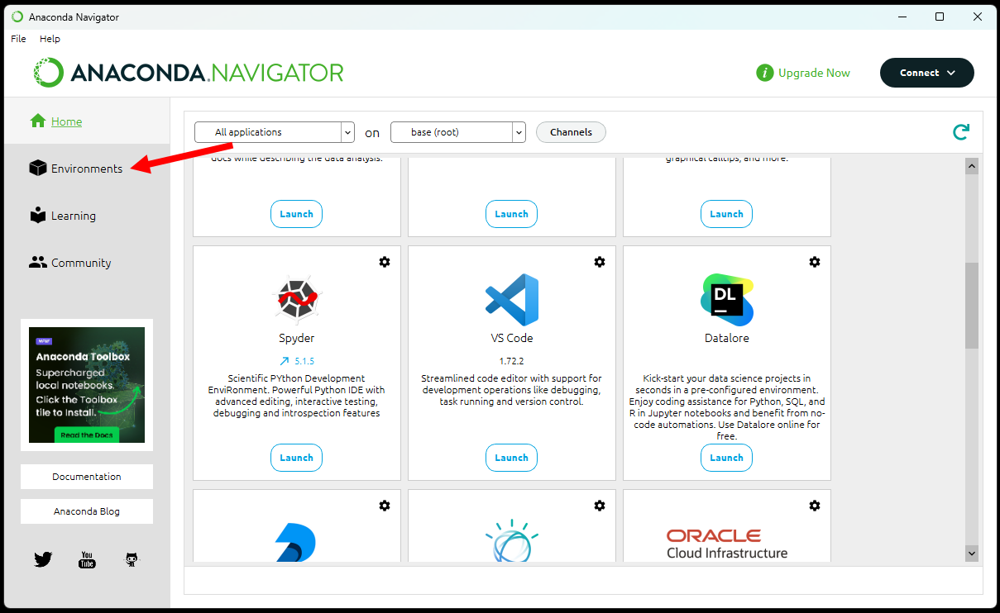
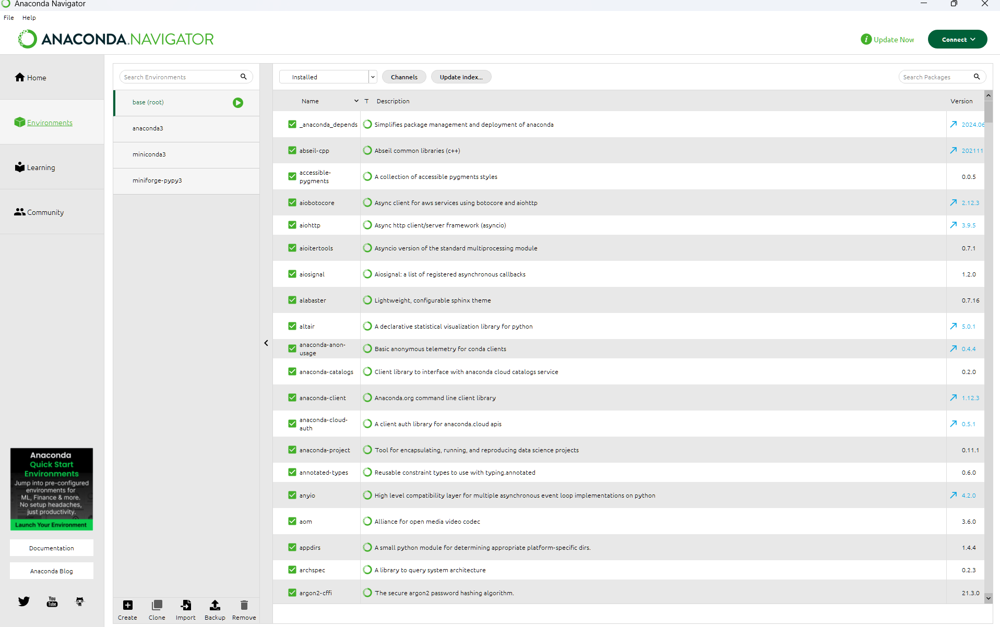
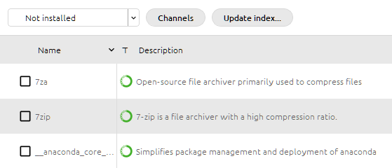

# Common Libraries

This section will introduce you to three commonly used libraries - NumPy, Matplotlib, and Pandas. It also covers how to read the documnetation of libraries like these.

Depending on how you installed Python you may or may not have these libraries installed. Below we explain how you can install them

## Installing Python Libraries

<details style="padding: 10px; border-radius: 2px; border: 1.5px solid gray"> 
<summary style= "font-size:130%"> Miniforge Installation</summary>

<h4> Using Miniforge </h4>

If you installed Python using Miniforge then you have the *conda* and *mamba* package managers installed. Note that they can be used interchangably

To install a package type the following in your terminal

```bash
conda install <package>
```
For example to install *Numpy*
```bash
conda install numpy
```

</details><br/>


<details style="padding: 10px; border-radius: 2px; border: 1.5px solid gray"> 
<summary style= "font-size:130%"> Anaconda Installation</summary>

<h4> Using Anaconda </h4>

If you installed Python using Anaconda then you have the conda package manager installed, but you will also have Anaconda Navigator installed. You can use this to manage libraries.

**Search for the program _Anaconda Navigator_ and open it**. After a few seconds, you should see a window like this appear:



This will then show you which packages are installed in the current *environment*.



Got to the dropdown in the top right which says installed. Select 'Not Installed'


The list will change to show libraries that can be installed. Find the one that you want and check it. A search box allows you to search the package list




</details><br/>


<details style="padding: 10px; border-radius: 2px; border: 1.5px solid gray"> 
<summary style= "font-size:130%"> Basic Python Installation</summary>

<h4> Using Python </h4>

If you installed Python using the basic method then you won't have conda instead you can use *pip* which is Python's own library manager.

To install a package type the following in your terminal

```bash
pip install numpy
```

</details><br/>