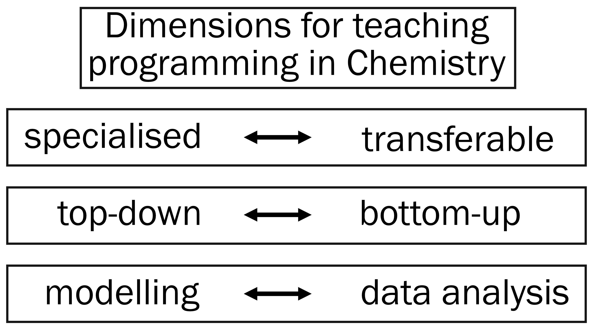

# State of Teaching

Miguel Rivera (UCL) & Andrew R. McCluskey (Bristol)

## Context

> What is the current state for Python in UK Chemistry degrees?

Programming has become an indispensable tool in research and many other graduate jobs for Chemists.
It is now commonplace to have some programming instruction as a part of Chemistry degrees, usually Python.
Due to the recency of this curriculum change, instructors in the UK are found wanting a community of practice.
At Chemistry Education conferences one can attend a session on "labs" or "assessment" but few, to our knowledge, propose the same for "computing" (the usual "technology" usually referring to using technology as an education tool).

This is not to fault any organisers of such conferences, who only supply what sessions are proposed by the audience.
Indeed, it is incumbent on programming instructors to start a dialogue with each other.
Becoming visible at conferences could be a result of a successful community of practice, but we should remind ourselves of the potential benefits of such an endeavour:

- Sharing teaching resources and practices to improve our instruction (inter)nationally.
- Providing a home for cross-institutional collaboration.
- Supporting colleagues to make their first steps in computing education.
- Amplifying the impact of computing education work.

With all of this in mind, we recently convened a first meeting of the new **Python in Chemistry** network (this name is not finalised).

## Meeting details

We (Miguel Rivera, UCL; Andrew McCluskey, Bristol) hosted a day-long meeting on the **5th of April 2024** at UCL.
It was advertised by direct email, Twitter, and the RSC Higher Education Group mailing list.
22 attendees from 12 British universities participated, despite a rail strike.
The event included of a few short presentations, but was mostly made up of free group discussions.
A whiteboard in the lecture room was used to take notes, and the information below is drawn from these notes.

We began by sharing how we taught Python at each university.

## Dimensions of teaching

> It was clear that there is a wide diversity of practices in the UK for teaching programming.

For each method, there are stories of success and failure.
It is not yet possible to make evidence-based recommendations, so this post will limit itself to descriptions of what choices people are currently making, implicitly or not.
We identify three dimensions to explore:

### Specialised and transferable

Some departments choose to place programming as an optional module in the 2nd or 3rd year of the undergraduate program.
This recognises that programming is not a tool that every Chemist uses, and therefore fits as a **specialisation** alongside modules like “drug design” or “materials chemistry”.

Others prefer to teach programming in the early years as a compulsory module, either standalone or packaged with other **transferable skills**, such as mathematics or report writing.
This means that programming an expected skill which later modules can exploit, for example in data analysis or modelling.

These two models may be able to coexist with enough buy-in from the department.

### Top-down and bottom-up

In either scenario, there were some different approachs for a student's first steps in Python.
Some institutions focused on **applications**, trying to quickly convey the usefulness of Python.
They may begin by presenting mostly complete scripts that load data using `pandas`, analyse it with `scipy`, and plot it in `matplotlib`.
Programming fundamentals are introduced as their need arises and some low-level content may even be omitted where it doesn't particularly help a student _use_ or _edit_ code.

The opposite approach sees students start with **fundamentals** of programming and syntax.
The first few lessons will invariably cover data types, conditional statements, iterators, and so on.
There may even be a lecture on logic.
The goal is to build a knowledge base comprehensive enough to understand every piece of a code that students are presented with, including code from the internet or generated by a large language model.
Students should also be able to write programs from scratch.
Here, exercise may see students write a `.csv` file parser to learn about file manipulation, despite the existence of the more concise `pandas.read_csv()`.

Again, ideas from both schools of thought can be mixed and matched.
It should be emphasised that in either case, the objective is for students to apply programming to solve Chemistry problems.
The distinction is about how deeply founded this problem solving skill should be, balanced with giving students tangible and accessible motivations for developing it.

### Modelling and data analysis

Similarly, the applications of Python which are provided to students primarily come from two areas.
Programming is often a necessary skill for computational chemists, so they are usually the first point of call for teaching it.
There is therefore a rich array of examples and problems inspired by the culture of **modelling**.
Students may be tasked with implementing a pair-potential function, or calculating geometrical properties based on `.xyz` files.
Once enough Python skills acquired, they can be used to illustrate implementations for molecular dynamics (see [pylj](https://github.com/arm61/pylj) and [ljmd](https://github.com/m-rivera/ljmd/tree/main)) or electronic structure methods (as in [Psi4numpy](https://github.com/psi4/psi4numpy)).
We have not observed, but can extrapolate, the use of Python as a driver for simulation (e.g. with [ASE](https://wiki.fysik.dtu.dk/ase/)) in the place of more traditional GUIs for students learning computational chemistry.

Another area of inspiration for applications is that of **data analysis**.
This fits much earlier in Chemistry curricula and has much broader applications in Chemistry.
Indeed, statistics and visualisation are as essential to master for computational, analytical, photo-, atmospheric chemists; the list goes on.
Students can be asked to calculate averages, detect peaks, and visualise various kinds of data sets.

Many of these tasks are already taught using spreadsheet software.
Instructors can decide to teach the analysis and visualisation portion with Python, limiting the spreadsheets to data entry.
This acknowledges the superior potential for automation and reproducibility of a programmed approach.
Conversely one can appreciate that data analysis continues to be carried out with spreadsheets in many workplaces, for their low barrier to entry and direct access to raw data, and teach both skills concurrently.

In both modelling and data analysis applications, the instructor must make choices about which order they present new information in.
> Is the programming being used to teach the application or the application used to teach the programming?

Both techniques are fruitful but we must be cautious of introducing new Chemical and programmatic concepts at the same time.

The three dimensions summarised above can help to situate the instructor in their teaching.
We can guess that a good practice for a comprehensive Python education would pool from all of them: a learner would learn Python for its own sake but also in the service of other Chemsitry goals, with solid fundamentals alternating with practical applications pooling from both modelling and data analysis.
However, this is only speculative and it would require more teaching time than a single module.

## Integration in the whole degree

Indeed, a recurring theme was that of connecting Python with other parts of the curriculum.

There was broad consensus that in order to motivate students to learn programming and to reinforce their understanding, they should be given plenty of opportunity to use programming in diverse parts of their degree.
This can be encouraged in theoretical modules (lectures, tutorials etc.) by using Python-driven demonstrations and simulations that students can interact with, e.g. stochastic processes to illustrate statistical mechanics results.
In practical modules, where instructors are used to helping students with their data analysis in spreadsheets, Python could be proposed as a first solution instead.

Of course, all of this depends on having a large part of the teaching team conversant in Python.
Unfortunately, there isn't yet a good source that teaches just the right amount of Python for busy academics and articulates its potential for teaching in various areas of Chemistry.
Another major obstacle is the effort it takes to update so much material, both from the main instructor and the programming expert who would need to offer guidance.
The change would have to be gradual, rolled out over the 3-4 years of a degree, and require enormous amounts of coordination and goodwill from teaching staff.

In the next blog post, we will discuss a platform where instructors could share their teaching resources and begin addressing these difficulties.